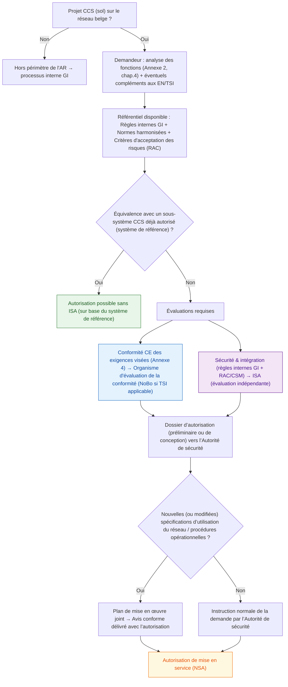
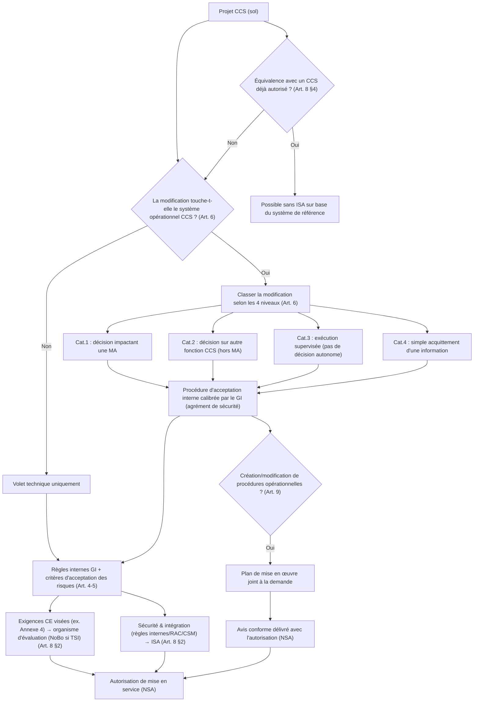

# Processus global d'autorisation de mise en service (AMES)

```mermaid
flowchart TB
    A["Projet CCS (sol) sur le réseau belge ?"] -->|Non| Z0["Hors périmètre de l'AR → processus interne GI"]
    A -->|Oui| B["Demandeur : analyse des fonctions (Annexe 2, chap.4) + éventuels compléments aux EN/TSI"]
    B --> C["Référentiel disponible : Règles internes GI + Normes harmonisées + Critères d'acceptation des risques (RAC)"]
    C --> D{"Équivalence avec un sous-système CCS déjà autorisé (système de référence) ?"}
    D -->|Oui| Z1["Autorisation possible sans ISA (sur base du système de référence)"]
    D -->|Non| E["Évaluations requises"]
    E --> F["Conformité CE des exigences visées (Annexe 4) → Organisme d'évaluation de la conformité (NoBo si TSI applicable)"]
    E --> G["Sécurité & intégration (règles internes GI + RAC/CSM) → ISA (évaluation indépendante)"]
    F --> H["Dossier d’autorisation (préliminaire ou de conception) vers l’Autorité de sécurité"]
    G --> H
    H --> I{"Nouvelles (ou modifiées) spécifications d’utilisation du réseau / procédures opérationnelles ?"}
    I -->|Oui| J["Plan de mise en œuvre joint → Avis conforme délivré avec l’autorisation"]
    I -->|Non| K["Instruction normale de la demande par l’Autorité de sécurité"]
    J --> L["Autorisation de mise en service (NSA)"]
    K --> L
    style Z1 fill:#e8f5e9,stroke:#2e7d32,color:#1b5e20
    style F fill:#e3f2fd,stroke:#1565c0,color:#0d47a1
    style G fill:#f3e5f5,stroke:#6a1b9a,color:#4a148c
    style L fill:#fff8e1,stroke:#ef6c00,color:#e65100
```

# Catégories OPE

```mermaid
flowchart TB
    A["Projet CCS (sol)"] --> B{"La modification touche-t-elle le système opérationnel CCS ? (Art. 6)"}
    B -->|Non| T1["Volet technique uniquement"]
    B -->|Oui| O1["Classer la modification selon les 4 niveaux (Art. 6)"]

    %% Volet opérationnel (Art. 6 -> procédure interne)
    O1 --> N1["Cat.1 : décision impactant une MA"]
    O1 --> N2["Cat.2 : décision sur autre fonction CCS (hors MA)"]
    O1 --> N3["Cat.3 : exécution supervisée (pas de décision autonome)"]
    O1 --> N4["Cat.4 : simple acquittement d'une information"]

    N1 --> P_OP["Procédure d'acceptation interne calibrée par le GI (agrément de sécurité)"]
    N2 --> P_OP
    N3 --> P_OP
    N4 --> P_OP

    %% Volet technique (règles internes + CE/ISA)
    T1 --> R1["Règles internes GI + critères d'acceptation des risques (Art. 4-5)"]
    P_OP --> R1
    R1 --> E_CE["Exigences CE visées (ex. Annexe 4) → organisme d'évaluation (NoBo si TSI) (Art. 8 §2)"]
    R1 --> E_ISA["Sécurité & intégration (règles internes/RAC/CSM) → ISA (Art. 8 §2)"]

    %% Cas d'équivalence
    A --> EQ{"Équivalence avec un CCS déjà autorisé ? (Art. 8 §4)"}
    EQ -->|Oui| BYP["Possible sans ISA sur base du système de référence"]
    EQ -->|Non| B

    %% OPE à créer/modifier → avis conforme (Art. 9)
    P_OP --> OPEQ{"Création/modification de procédures opérationnelles ? (Art. 9)"}
    OPEQ -->|Oui| PLAN["Plan de mise en œuvre joint à la demande"]
    PLAN --> AVIS["Avis conforme délivré avec l'autorisation (NSA)"]

    %% Autorisation
    E_CE --> AUTH["Autorisation de mise en service (NSA)"]
    E_ISA --> AUTH
    AVIS --> AUTH
```

