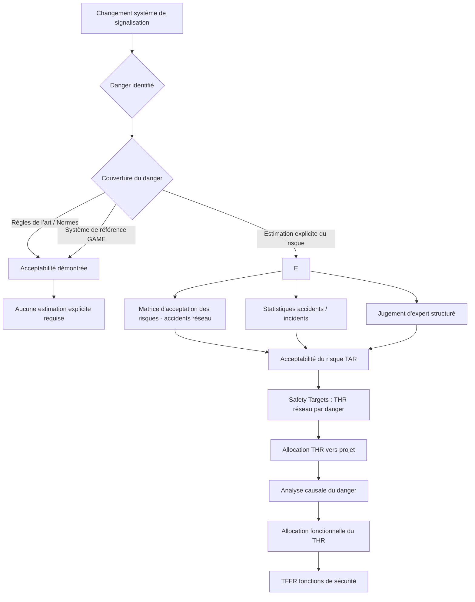

# 1. Exigences

2 JUIN 2025. - Arrêté royal relatif aux exigences applicables à l'infrastructure ferroviaire concernant les conditions d'autorisation de mise en service du sous-système CCS et son intégration en sécurité dans le système ferroviaire belge

Art. 5. Conformément au point 2.5 de l'annexe I à la MSC évaluation des risques, le gestionnaire de l'infrastructure établit, sur la base des exigences énoncées à l'annexe 2, chapitre 3, les critères d'acceptation des
risques pour les sous-systèmes CCS nouveaux, renouvelés ou réaménagés pour les installations CCS de son réseau. Il intègre ces critères dans son agrément de sécurité.

Art. 7. § 1er. Le demandeur d'un projet relatif à un sous-système CCS établit une analyse des fonctions concernées de l'installation CCS conformément à l'annexe 2, chapitre 4.
Le demandeur peut déterminer par rapport à son projet des exigences complémentaires aux normes EN et aux
normes harmonisées qui sont le cas échéant applicables en vertu de la STI CCS.
§ 2. L'analyse, les normes et les exigences complémentaires aux normes visées au paragraphe 1er constituent
le référentiel pour l'évaluation du projet par un ISA.
Lors de son évaluation, l'ISA vérifie également si le projet respecte les critères d'acceptation des risques établis
conformément à l'annexe de la MSC évaluation des risques, par le gestionnaire de l'infrastructure concerné.
§ 3. Le demandeur inclut l'ensemble des éléments visés au paragraphe 2 dans le dossier préliminaire visé à
l'article 179/1, § 4, du Code ferroviaire ou, en cas de renouvellement ou de réaménagement, dans le dossier de
conception visé à l'article 179/1, § 8, du Code ferroviaire.
§ 4. En cas de nouveau projet, le demandeur qui introduit un dossier préliminaire auprès de l'autorité de sécurité
indique dans son dossier :
1° les règles internes du gestionnaire de l'infrastructure concerné visées à l'article 4 qui s'appliquent au projet ;
2° le cas échéant, les exigences que ce demandeur a déterminées complétant les normes européennes
harmonisées, conformément au paragraphe 1er, alinéa 2.
En cas de renouvellement ou de réaménagement, le demandeur reprend les éléments visés à l'alinéa 1er dans
son dossier de conception.

CHAPITRE 4.
- Dispositions transitoires
Art. 11. Au plus tard pour le 18 juillet 2028, le gestionnaire de l'infrastructure qui disposait déjà d'un agrément de sécurité en cours de validité au jour de l'entrée en vigueur du présent arrêté adopte de nouveaux critères d'acceptation des risques établis conformément à l'article 5.
Au plus tard six mois après le jour de l'entrée en vigueur du présent arrêté, le gestionnaire de l'infrastructure
visé à l'alinéa 1er fournit à l'autorité de sécurité un document décrivant le plan d'actions et la méthodologie pour la mise en oeuvre de l'article 5 sur une période s'étendant jusqu'au 18 juillet 2028 au plus tard.
Art. 12. Sans préjudice de l'article 11, alinéa 2, le présent arrêté est d'application un an après le jour de son entrée en vigueur.
Sans préjudice de l'article 13, et en vue de l'application de l'alinéa 1er, l'arrêté royal du 1er juillet 2011 déterminant les exigences applicables à l'infrastructure ferroviaire continue à s'appliquer pendant un an à compter du jour d'entrée en vigueur du présent arrêté.

CHAPITRE 3.
- Exigences applicables à la détermination par le gestionnaire de l'infrastructure des critères d'acceptation des risques Les exigences applicables à la détermination par le gestionnaire de l'infrastructure des
critères d'acceptation des risques pour le sous-système CCS sont :
o l'utilisation de :
o la THR comme exigence de fiabilité pour le sous-système pendant sa durée de vie, conformément aux points 3.1, 3.2, 3.4 ;
ou
o la probabilité maximale d'un accident ou d'un autre évènement indésirable, conformément au point 3.3 ;
o la détermination des limites du paramètre ci-dessus choisi.
Les critères qui s'appuient sur la THR servent de valeurs-cibles pour le demandeur pour le sous-système CCS.
Liste des éléments que le gestionnaire de l'infrastructure reprend dans les critères d'acceptation des risques
conformément aux dispositions ci-dessus :
3.1 La THR " réseau " :
La THR " réseau " vaut pour les réseaux dans lesquels l'ETCS a été intégré dans l'installation CCS et est déterminée pour chaque mode de supervision de l'ETCS (full supervision " FS " ou Limited Supervision " LS " ).
3.2 Exigences de disponibilité des fonctions du système ETCS intégré en relation avec les procédures opérationnelles CCS.
Ces exigences de disponibilité q(T) (voir chapitre 2) intègrent l'influence des périodicités de la maintenance et de la détection des défaillances de l'installation CCS et ce, afin de limiter autant que possible le recours aux procédures opérationnelles CCS.
Les procédures opérationnelles CCS couvrant une période d'indisponibilité partielle ou totale du système ETCS intégré, font l'objet d'une analyse de risque et répondent au moins aux exigences suivantes :
a) Fiabilité équivalente conformément à la THR de l'installation à bord associée à l'ETCS Auxiliary Hazard de la STI CCS (subset 091) concernant les procédures opérationnelles relatives au conducteur du train ;
b) Une procédure opérationnelle CCS qui concerne une MA à vitesse nominale sur un tronçon de voie ne peut être acceptée que si l'indisponibilité de la fonction concernée de l'ETCS intégré a été explicitement déterminée
(voir chapitre 3) et que l'indisponibilité se limite à ce tronçon de voie.
Dans tous les autres cas, la procédure opérationnelle doit aller de pair avec une vitesse autorisée réduite ou éventuellement d'autres mesures réduisant les risques.
3.3 Le risque de l'atteinte d'un point dangereux sur une ligne disposant du système ETCS intégré.
En fonction de la probabilité du danger de l'atteinte du point dangereux, les catégories de critères suivantes sont au moins prévues :
a) acceptation du risque au moyen de la démonstration explicite de la faible probabilité du danger ;
b) acceptation du risque grâce à la neutralisation du danger par le biais de dispositions techniques ;
c) acceptation du risque grâce à une analyse de risque :
1. en fonction de la gravité potentielle d'un accident au niveau d'un point dangereux spécifique et de la
probabilité de l'atteinte de ce point ;
2. en cas de renouvellement ou de réaménagement d'installations CCS existantes, sur la base du maintien du niveau de risque existant. Le niveau de risque existant est déterminé sur la base des statistiques des incidents ou sur la base des critères valables pour les systèmes de référence conformément à la MSC évaluation des risques.
L'acceptation du risque de l'atteinte d'un point dangereux sur une ligne disposant du système ETCS intégré,
incombe au gestionnaire de l'infrastructure ferroviaire de la ligne disposant du système ETCS intégré, qui doit également tenir compte des dangers de défaillances d'infrastructures ferroviaires ne disposant pas du système ETCS intégré ou des dangers trouvant leur origine dans des infrastructures ferroviaires dont il n'est pas le
gestionnaire.
3.4 Pour les composants de son installation CCS déjà en service, le gestionnaire de l'infrastructure fournit dans la mesure du possible les informations nécessaires pour que le demandeur puisse se conformer aux dispositions du chapitre 4, point 4.3.

CHAPITRE 4.
- Exigences applicables à l'analyse des fonctions et à la détermination des défaillances par le demandeur 
L'analyse des fonctions visées à l'article 7, § 1er, alinéa 1er, concerne au minimum les catégories 4.1
et 4.2 du présent chapitre et les défaillances jusqu'au niveau des composants.
Les catégories des fonctions CCS et défaillances sont :
4.1. Fonctions attribuées à l'installation CCS pour laquelle une défaillance de l'installation CCS ou d'un composant est susceptible d'occasionner une réduction non-souhaitée de la MA (raccourcissement inattendu de la MA suite à une défaillance de l'installation CCS qui potentiellement met en péril le respect de la courbe de freinage du train).
4.2. Fonctions nominalement attribuées à l'installation CCS pour lesquelles une défaillance de l'installation CCS
et/ou d'un composant et/ou une défaillance du système opérationnel, donne lieu à une MA erronée et/ou dangereuse.
4.3. Défaillances des composants de l'installation CCS :
a) Les FDC de la STI CCS (subset 091) s'appliquent pour les composants ETCS ;
b) Le demandeur détermine les FDC qui s'appliquent aux autres composants de l'installation CCS. Pour les
installations CCS déjà en service préalablement au projet, le gestionnaire de l'infrastructure communique, autant
que possible, ces FDC au demandeur.

# 2. Analyse des exigences critiques

Nous comprenons que la NSA :
- Souhaite qu'Infrabel clarifie ses critères d'acceptation des risques conformément à la MSC et aux normes en vigueur (CENELEC)
- Que ces critères soient intégrés dans l'agrément de sécurité
- Que ces critères soient une référence obligatoire pour les demandeurs de projets CCS, les ISA et la NSA

Infrabel a la liberté de définir des Safety Targets : 
- soit au niveau de la probabilité maximale d'un accident ou événement indésirable
- soit sous la forme d’un THR, exprimant une fréquence maximale tolérable de défaillances dangereuses du sous-système CCS, éventuellement agrégée au niveau réseau.

Notre compréhension est que l’article 5 et l’annexe 2 encadrent exclusivement l’acceptation du risque de sécurité ferroviaire (au sens MSC), et non la performance de disponibilité en tant que telle.
En particulier, l’arrêt d’un train dû à une défaillance de signalisation, même lorsque cela déclenche des procédures opérationnelles, ne constitue pas un danger et n’appelle donc pas de critère THR.

# 3. Critères d'acceptation des risques

## Généralités 

Il est vérifié que chaque danger est adéquatement couvert par :
- l’application des règles de l’art correspondantes ;
- l’utilisation d’un système de référence ;
- l’estimation explicite des risques.

## Estimation explicite des risques pour la signalisation

Infrabel réalise une estimation explicite des risques conformément à la CSM et plus particulièrement à la norme EN 50126-2:2017.

Nous identifions nos Safety Targets pour chaque changement à associé à un système de signalisation sur base de ces options, en conformité avec EN 50126-2 :
- NB : Check s'il existe une norme qui impose une Safety Target pour le système concerné ; par exemple : ... 
Dans ce cas, on peut considérer que l'application des règles de l'art permet de démontrer l'acceptabilité des risques et l'on n'est donc pas dans le cadre d'une estimation de risque explicite.
- Nous utilisons une matrice d’acceptation des risques définie au niveau des accidents pour statuer sur l’acceptabilité du risque à l’échelle du réseau. Les fréquences tolérables issues de cette matrice sont ensuite formalisées sous forme de THR applicables aux dangers associés, ce qui constitue une approche hybride accident‑based pour l’acceptabilité et danger‑based pour la définition des Safety Targets, conformément à EN 50126‑2.

## Identification des Safety Targets – EN 50126-2

Pour chaque changement associé à un système de signalisation, les **Safety Targets** sont identifiés conformément à **EN 50126‑2**, en s’appuyant sur l’une ou une combinaison des approches ci‑dessous, selon le contexte et la disponibilité des données.

---

### Approches permises pour l’acceptabilité du risque

#### 1. Application de règles de l’art / normes reconnues
- Vérification préalable de l’existence de normes, STI ou codes de bonne pratique applicables imposant implicitement un niveau de sécurité accepté.
- Lorsque ces règles couvrent correctement les dangers identifiés :
  - l’acceptabilité du risque est démontrée par la conformité,
  - aucun Safety Target chiffré n’est requis,
  - l’approche ne relève pas d’une estimation explicite du risque au sens de l’EN 50126‑2.

---

#### 2. Matrice d’acceptation des risques (approche hybride)
- Utilisation d’une **matrice d’acceptation des risques définie au niveau des accidents (conséquences)** et appliquée à l’échelle du **réseau**.
- La matrice permet de statuer sur l’acceptabilité du risque et d’identifier une **fréquence tolérable réseau** en fonction de la gravité.
- Les fréquences tolérables issues de la matrice sont ensuite **formalisées en THR applicables aux dangers associés**.
- Cette démarche constitue :
  - une approche **accident‑based** pour l’acceptabilité du risque,
  - et **danger‑based** pour la définition des Safety Targets (THR),
  conformément à EN 50126‑2.

---

#### 3. Approche basée sur les statistiques d’accidents / incidents
- Exploitation des statistiques d’accidents, d’incidents ou de quasi‑incidents du réseau ou de réseaux comparables.
- Ces données permettent de définir des **TAR (niveaux ou taux de risque acceptables)** reflétant le niveau de risque historiquement accepté.
- Les TAR sont ensuite traduits en **THR réseau** pour les dangers concernés.
- Approche particulièrement adaptée aux systèmes existants disposant d’un retour d’expérience suffisant.

---

#### 4. Jugement d’expert structuré
- Utilisé lorsque les données quantitatives sont insuffisantes ou non pertinentes.
- Basé sur l’expertise collective, l’expérience opérationnelle et la comparaison avec des systèmes analogues.
- Les hypothèses, raisonnements et conclusions sont documentés et traçables.
- Approche reconnue par EN 50126‑2 comme estimation explicite du risque (qualitative ou semi‑quantitative).

---

### Suite du processus (commune à toutes les approches)

Quelle que soit l’approche retenue pour l’acceptabilité du risque, la suite du processus est identique :

#### Étape 1 – THR réseau
- Formalisation des Safety Targets sous forme de **THR réseau** applicables aux dangers identifiés.

#### Étape 2 – THR local / projet
- Allocation du THR réseau au périmètre du projet ou de l’installation, en fonction de l’exposition et du contexte opérationnel.

#### Étape 3 – Décomposition causale
- Analyse des causes du danger (arbres de pannes, scénarios) afin d’identifier les fonctions contributrices.

#### Étape 4 – TFFR fonctions
- Allocation du THR local aux fonctions de sécurité jusqu’au dernier niveau d’indépendance démontrable.
- Définition des **TFFR**, servant de base à l’allocation des SIL et à la démonstration de conformité.

---

### Synthèse

EN 50126‑2 autorise plusieurs approches pour statuer sur l’acceptabilité du risque.  
Quelle que soit la méthode retenue, les Safety Targets sont formalisés en **THR**, puis déclinés de manière cohérente au niveau projet et fonctionnel jusqu’aux **TFFR**.

## Plan d'actions

RGE 105.1 contient une matrice d'appréciation des risques pas aussi complète que celle donnée dans la Safety Management Proc. (Fréquence d'occurence "0" en plus).