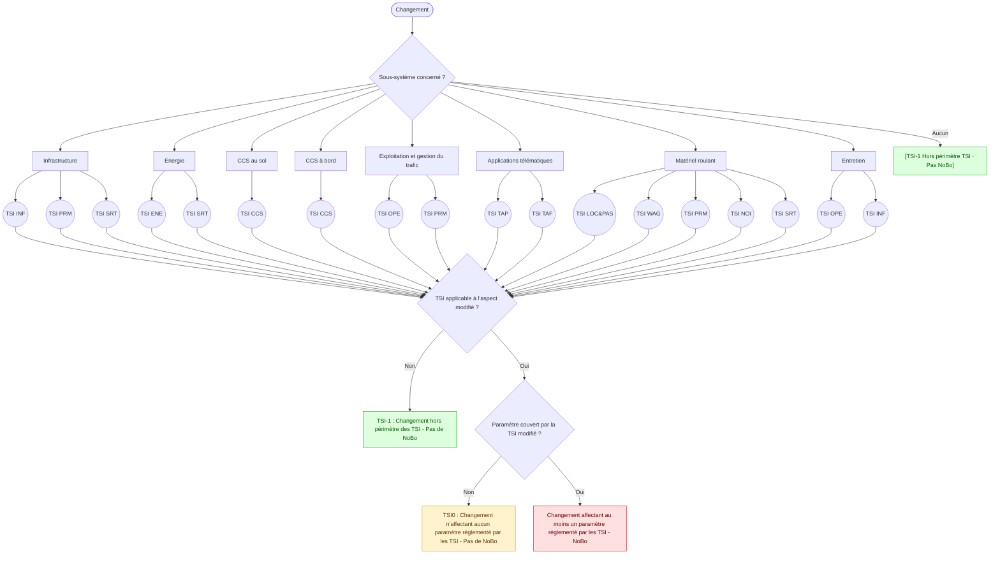

```mermaid
flowchart TD

%% Départ
START([Changement]) --> SYS{Sous-système concerné ?}

%% Sous-systèmes (une ligne chacun)
SYS --> INF[Infrastructure]
SYS --> ENE[Energie]
SYS --> CCSG[CCS au sol]
SYS --> CCSA[CCS à bord]
SYS --> OPE[Exploitation et gestion du trafic]
SYS --> TEL[Applications télématiques]
SYS --> RST[Matériel roulant]
SYS --> MNT[Entretien]

SYS -->|Aucun| OUT_TSI_MINUS1["[TSI-1 Hors périmètre TSI · Pas NoBo]"]

%% TSI candidates par sous-système (nœuds séparés, une ligne)
INF --> T_INF_INF((TSI INF))
INF --> T_INF_PRM((TSI PRM))
INF --> T_INF_SRT((TSI SRT))

ENE --> T_ENE_ENE((TSI ENE))
ENE --> T_ENE_SRT((TSI SRT))

CCSG --> T_CCS_SOL((TSI CCS))
CCSA --> T_CCS_BORD((TSI CCS))

OPE --> T_OPE_OPE((TSI OPE))
OPE --> T_OPE_PRM((TSI PRM))

TEL --> T_TEL_TAP((TSI TAP))
TEL --> T_TEL_TAF((TSI TAF))

RST --> T_RST_LOC((TSI LOC&PAS))
RST --> T_RST_WAG((TSI WAG))
RST --> T_RST_PRM((TSI PRM))
RST --> T_RST_NOI((TSI NOI))
RST --> T_RST_SRT((TSI SRT))

MNT --> T_MNT_OPE((TSI OPE))
MNT --> T_MNT_INF((TSI INF))

%% Test d'applicabilité (commun)
T_INF_INF --> APPL
T_INF_PRM --> APPL
T_INF_SRT --> APPL
T_ENE_ENE --> APPL
T_ENE_SRT --> APPL
T_CCS_SOL --> APPL
T_CCS_BORD --> APPL
T_OPE_OPE --> APPL
T_OPE_PRM --> APPL
T_TEL_TAP --> APPL
T_TEL_TAF --> APPL
T_RST_LOC --> APPL
T_RST_WAG --> APPL
T_RST_PRM --> APPL
T_RST_NOI --> APPL
T_RST_SRT --> APPL
T_MNT_OPE --> APPL
T_MNT_INF --> APPL

APPL{TSI applicable à l'aspect modifié ?} -->|Non| OUT_TSI_MINUS1B["TSI-1 : Changement hors périmètre des TSI - Pas de NoBo"]
APPL -->|Oui| PARAM{Paramètre couvert par la TSI modifié ?}

%% Catégories TSI
PARAM -->|Non| OUT_TSI0["TSI0 : Changement n’affectant aucun paramètre réglementé par les TSI - Pas de NoBo"]
PARAM -->|Oui| OUT_TSI1["Changement affectant au moins un paramètre réglementé par les TSI - NoBo"]

%% Styles
classDef green fill:#ddffdd,stroke:#0a0,color:#050;
classDef amber fill:#fff3cd,stroke:#c90,color:#630;
classDef red fill:#ffe0e0,stroke:#c00,color:#600;

class OUT_TSI_MINUS1,OUT_TSI_MINUS1B green
class OUT_TSI0 amber
class OUT_TSI1 red
```