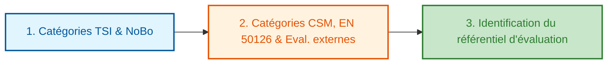
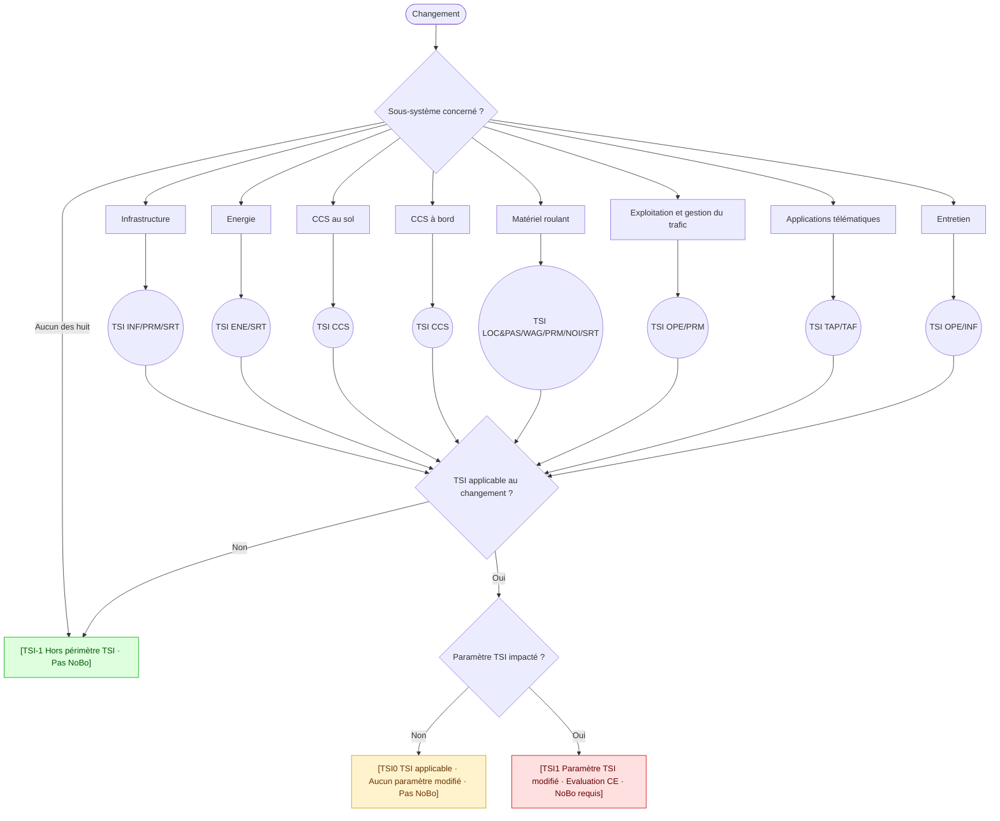
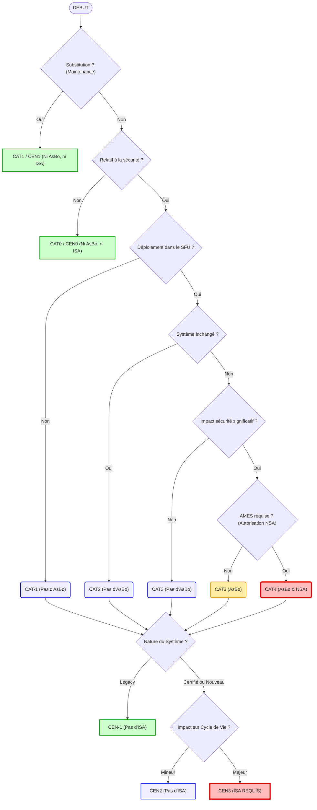

```mermaid
flowchart TD
    %% =================================================================================
    %% CHECKLIST VERTICALE DES SOUS-SYSTEMES
    %% =================================================================================
    START(["DÉBUT : Identification Référentiel"]) --> CHECK_INF{"Infrastructure (INF) ?"}

    %% 1. INFRASTRUCTURE
    CHECK_INF -->|Oui| Q_TSI_INF{"TSI INF, PRM, SRT (TSI1) ?"}
    Q_TSI_INF -->|Oui| ADD_INF["+ TSI INF / PRM / SRT (NoBo)"]:::tsi
    Q_TSI_INF -->|Non| SKIP_INF((.))
    CHECK_INF -->|Non| SKIP_INF
    ADD_INF --> CHECK_CCSG
    SKIP_INF --> CHECK_CCSG

    %% 2. CCS SOL
    CHECK_CCSG{"CCS Sol (CCSG) ?"}
    CHECK_CCSG -->|Oui| Q_TSI_CCSG{"TSI CCS (TSI1) ?"}
    Q_TSI_CCSG -->|Oui| ADD_CCSG["+ TSI CCS (NoBo)"]:::tsi
    Q_TSI_CCSG -->|Non| SKIP_CCSG((.))
    CHECK_CCSG -->|Non| SKIP_CCSG
    ADD_CCSG --> CHECK_CCSA
    SKIP_CCSG --> CHECK_CCSA

    %% 3. CCS BORD
    CHECK_CCSA{"CCS Bord (CCSA) ?"}
    CHECK_CCSA -->|Oui| Q_TSI_CCSA{"TSI CCS (TSI1) ?"}
    Q_TSI_CCSA -->|Oui| ADD_CCSA["+ TSI CCS (NoBo)"]:::tsi
    Q_TSI_CCSA -->|Non| SKIP_CCSA((.))
    CHECK_CCSA -->|Non| SKIP_CCSA
    ADD_CCSA --> CHECK_ENE
    SKIP_CCSA --> CHECK_ENE

    %% 4. ENERGIE
    CHECK_ENE{"Energie (ENE) ?"}
    CHECK_ENE -->|Oui| Q_TSI_ENE{"TSI ENE, SRT (TSI1) ?"}
    Q_TSI_ENE -->|Oui| ADD_ENE["+ TSI ENE / SRT (NoBo)"]:::tsi
    Q_TSI_ENE -->|Non| SKIP_ENE((.))
    CHECK_ENE -->|Non| SKIP_ENE
    ADD_ENE --> CHECK_RST
    SKIP_ENE --> CHECK_RST

    %% 5. MATERIEL ROULANT
    CHECK_RST{"Matériel Roulant (RST) ?"}
    CHECK_RST -->|Oui| Q_TSI_RST{"TSI LOC&PAS, WAG, PRM, NOI, SRT (TSI1) ?"}
    Q_TSI_RST -->|Oui| ADD_RST["+ TSI LOC&PAS / WAG / ... (NoBo)"]:::tsi
    Q_TSI_RST -->|Non| SKIP_RST((.))
    CHECK_RST -->|Non| SKIP_RST
    ADD_RST --> CHECK_OPE
    SKIP_RST --> CHECK_OPE

    %% 6. EXPLOITATION
    CHECK_OPE{"Exploitation (OPE) ?"}
    CHECK_OPE -->|Oui| Q_TSI_OPE{"TSI OPE, PRM (TSI1) ?"}
    Q_TSI_OPE -->|Oui| ADD_OPE["+ TSI OPE / PRM (NoBo)"]:::tsi
    Q_TSI_OPE -->|Non| SKIP_OPE((.))
    CHECK_OPE -->|Non| SKIP_OPE
    ADD_OPE --> CHECK_MNT
    SKIP_OPE --> CHECK_MNT

    %% 7. ENTRETIEN
    CHECK_MNT{"Entretien (MNT) ?"}
    CHECK_MNT -->|Oui| Q_TSI_MNT{"TSI INF, OPE (Maintenance) (TSI1) ?"}
    Q_TSI_MNT -->|Oui| ADD_MNT["+ TSI ... (NoBo)"]:::tsi
    Q_TSI_MNT -->|Non| SKIP_MNT((.))
    CHECK_MNT -->|Non| SKIP_MNT
    ADD_MNT --> CHECK_TEL
    SKIP_MNT --> CHECK_TEL

    %% 8. APPLICATIONS TELEMATIQUES
    CHECK_TEL{"App. Télématiques (TEL) ?"}
    CHECK_TEL -->|Oui| Q_TSI_TEL{"TSI TAF, TAP (TSI1) ?"}
    Q_TSI_TEL -->|Oui| ADD_TEL["+ TSI TAF / TAP (NoBo)"]:::tsi
    Q_TSI_TEL -->|Non| SKIP_TEL((.))
    CHECK_TEL -->|Non| SKIP_TEL
    
    %% =================================================================================
    %% CSM / ETCS / CENELEC
    %% =================================================================================
    ADD_TEL --> CHECK_ETCS
    SKIP_TEL --> CHECK_ETCS

    CHECK_ETCS{"TSI CCS 2023 (ETCS) ?"}
    CHECK_ETCS -->|Oui| FORCE_ASBO["+ CSM RA (AsBo) - Obligatoire"]:::alert
    CHECK_ETCS -->|Non| Q_CSM{"Catégorie CSM ?"}

    FORCE_ASBO --> NEXT_CEN((Suite))

    Q_CSM -->|CAT3| ADD_CAT3["+ CSM RA (AsBo)"]:::csm
    Q_CSM -->|CAT4| ADD_CAT4["+ CSM RA (AsBo & NSA)"]:::csm
    Q_CSM -->|Autre| SKIP_CSM((.)):::gray

    ADD_CAT3 & ADD_CAT4 & SKIP_CSM --> NEXT_CEN

    NEXT_CEN --> Q_CEN{"Catégorie CENELEC ?"}
    
    Q_CEN -->|CEN3| ADD_CEN3["+ EN 50126 (ISA)"]:::cen
    Q_CEN -->|CEN2| ADD_CEN2["+ EN 50126 (Pas d'ISA)"]:::cen
    Q_CEN -->|Autre| SKIP_CEN((.)):::gray

    ADD_CEN3 & ADD_CEN2 & SKIP_CEN --> Q_SIG_HW{"Matériel Signalisation ?"}
    
    Q_SIG_HW -->|Oui| ADD_50129["+ EN 50129"]:::cen    
    Q_SIG_HW -->|Non| NEXT_SW((Suite))
    ADD_50129 --> NEXT_SW

    NEXT_SW --> Q_SW{"Logiciel (SW) ?"}
    Q_SW -->|Oui| ADD_50128["+ EN 50128"]:::cen
    Q_SW -->|Non| END([Fin Référentiel])
    ADD_50128 --> END

    %% Styles
    classDef tsi fill:#e1f5fe,stroke:#01579b,stroke-width:2px;
    classDef csm fill:#fff3e0,stroke:#e65100,stroke-width:2px;
    classDef cen fill:#f3e5f5,stroke:#4a148c,stroke-width:2px;
    classDef gray fill:#f5f5f5,stroke:#999,stroke-width:1px,stroke-dasharray: 5 5;
    classDef alert fill:#ffebee,stroke:#c62828,stroke-width:3px;
```

# Processus d'évaluation externe : Vue d'ensemble

Cliquez sur les boîtes ci-dessous pour accéder au détail de chaque étape.

> **Navigation rapide** : [1. Détail TSI](#1-tsi) | [2. Détail CSM & EN 50126](#2-csm-cen) | [3. Identification Référentiel](#3-referentiel)

---

## 1. Catégorie TSI et NoBo

[Retour en haut](#processus-dévaluation-externe--vue-densemble)

## Définition des catégories et impacts

### Catégories TSI (Interopérabilité)

| ID | Définition | Impact évaluation |
| :--- | :--- | :--- |
| **TSI-1** | Changement hors périmètre des TSI | Pas de NoBo |
| **TSI0** | Changement n’affectant aucun paramètre réglementé par les TSI | NoBo |
| **TSI1** | Changement affectant au moins un paramètre réglementé par les TSI | NoBo |

---

## 2. Catégories CSM, CENELEC & Eval. externes

[Retour en haut](#processus-dévaluation-externe--vue-densemble)

---

## Définition des catégories et impacts

### Catégories CSM (Sécurité)

| ID | Définition | Impact évaluation |
| :--- | :--- | :--- |
| **CAT-1** | Changement hors périmètre de la CSM | Pas d’AsBo |
| **CAT0** | Changement non relatif à la sécurité | Pas d’AsBo |
| **CAT1** | Substitution dans le cadre d'un entretien | Pas d’AsBo |
| **CAT2** | Changement relatif à la sécurité avec impact non-significatif | Pas d’AsBo (sauf si TSI CCS 2023 est applicable) |
| **CAT3** | Changement relatif à la sécurité avec impact significatif sans autorisation de mise en service par la NSA | AsBo |
| **CAT4** | Changement relatif à la sécurité avec impact significatif et avec autorisation de mise en service par la NSA | AsBo & NSA AMES |

### Catégories EN 50126 (CENELEC)

| ID | Définition | Impact évaluation |
| :--- | :--- | :--- |
| **CEN-1** | Changement hors périmètre de EN 50126 | Pas d’ISA |
| **CEN0** | Changement non relatif à la sécurité | Pas d’ISA |
| **CEN1** | Substitution dans le cadre d'un entretien | Pas d’ISA |
| **CEN2** | Changement nécessistant aucunes ou des preuves de sécurité mineures | Pas d’ISA |
| **CEN3** | Changement nécessistant des preuves de sécurité significatives | ISA |

---

## 3. Identification du référentiel d'évaluation

[Retour en haut](#processus-dévaluation-externe--vue-densemble)

