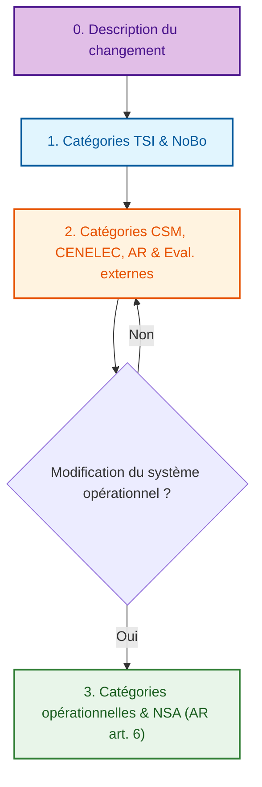
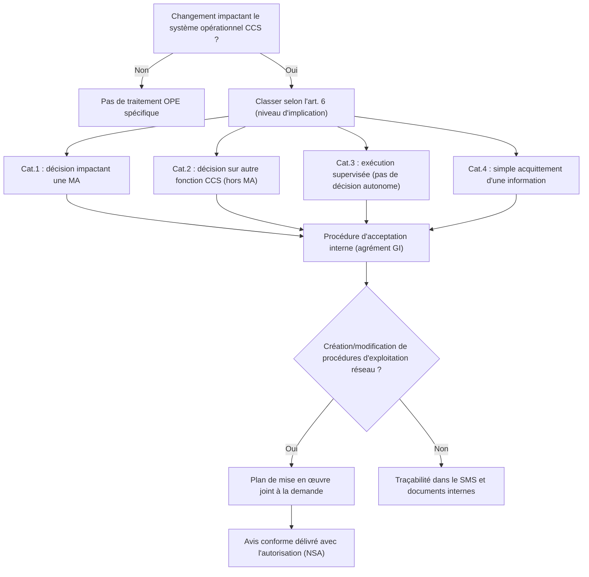

# Processus d'évaluation : Vue d'ensemble

Cliquez sur les boîtes ci-dessous pour accéder au détail de chaque étape.

> **Navigation rapide** : [0. Description](#0-desc) | [1. Détail TSI](#1-tsi) | [2. Détail CSM & EN 50126](#2-csm-cen) | [3. Catégories opérationnelles & NSA](#3-ope)

---

---

## 0. Description du changement

### 0.1 Diagramme d'identification du type du changement (par sous-système) :

Sélectionner le type de changement parmi les options suivantes :
   
NB : **SFU** = Système Ferroviaire de l'Union

```mermaid
flowchart TB
    %% Nodes
    START("0. INITIALISATION")

    %% Etape 1 : Sous-systèmes
    SUBSYS{1. Identification des sous-systèmes impactés}
    SUBSYS_LIST["Le changement impacte ce(s) sous-système(s) :
    □ Infrastructure
    □ Energie
    □ Contrôle-commande et signalisation au sol
    □ Contrôle-commande et signalisation à bord
    □ Exploitation et gestion du trafic
    □ Applications télématiques 
    □ Matériel roulant
    □ Entretien"]
    
    %% Etape 2 : Système de référence
    REF_SYS{2. Identification Système de Référence}
    REF_SYS_LIST["Pour chaque sous-système :
    □ Système de référence identifié ?
    □ Système de référence legacy ?
    □ Niveau SIL associé (ex: SIL2, SIL4) ?"]

    %% Etape 3 : Substitution
    Q_SUBST{"3. Substitution ?"}

    %% Etape 4 : Déploiement HORS PROJET (Sans déploiement)
    Q_NO_DEP{"4. Déploiement Hors Projet ?"}
    
    %% Etape 5 : Système Inchangé
    Q_UNCH{"5. Système de référence inchangé ?"}

    %% --- FEUILLES (Boîtes résultats avec Titres Complets) ---
    %% Substitution
    SUBST_RES["□ (S.L) Substitution d'un produit legacy existant
    □ (S.C) Substitution d'un produit certifié existant"]
    
    %% Sans Déploiement (Hors Projet)
    RES_NO_DEP["□ (ML) Modification d'un système de référence legacy sans déploiement prévu dans ce projet
    □ (MC) Modification d'un système de référence certifié sans déploiement prévu dans ce projet
    □ (N) Création d'un nouveau système sans déploiement prévu dans ce projet"]

    %% Résultats Inchangé
    RES_IN_U["<b>SI DÉPLOIEMENT DANS SFU :</b>
    □ (DL) Déploiement d'un système legacy de référence inchangé
    □ (DC) Déploiement d'un système de référence certifié et inchangé
    ___
    <b>SI DÉPLOIEMENT HORS SFU :</b>
    □ (DHUL) Déploiement hors SFU d'un système de référence legacy et inchangé
    □ (DHUC) Déploiement hors SFU d'un système de référence certifié et inchangé"]
    
    %% Résultats Modifié
    RES_MOD_NEW["<b>SI DÉPLOIEMENT DANS SFU :</b>
    □ (DML) Déploiement de la modification d'un système de référence legacy
    □ (DMC) Déploiement de la modification d'un système de référence certifié
    □ (DN) Création et déploiement d'un nouveau système
    ___
    <b>SI DÉPLOIEMENT HORS SFU :</b>
    □ (DHUML) Déploiement hors SFU de la modification d'un système de référence legacy
    □ (DHUMC) Déploiement hors SFU de la modification d'un système de référence certifié
    □ (DHUN) Création et déploiement hors SFU d'un nouveau système"]
    
    %% Etape Finale : Infos Déploiement
    DEPLOY_INFOS{Infos déploiement}
    DEPLOY_DET["Compléter si le phasage est applicable :
    □ Phase pilote (ex : L73 - ETCS L2 SWoLSS) :
    (DMC) Déploiement de la modification d'un sous-système de référence certifié
    □ Phase Rollout (ex : Lignes LXY LZZ LXX - ETCS L2 SWoLSS) :
    (DC) Déploiement d'un sous-système de référence certifié et inchangé
    □ Pas de phase (ex : L29) :
    (DMC) Déploiement de la modification d'un sous-système de référence certifié"]
    
    STOP((Fin))

    %% Relations principales (Flux vertical)
    START --> SUBSYS
    SUBSYS --- SUBSYS_LIST
    SUBSYS --> REF_SYS
    REF_SYS --- REF_SYS_LIST
    REF_SYS --> Q_SUBST
    
    %% Logique Substitution
    Q_SUBST -->|Oui| SUBST_RES
    Q_SUBST -->|Non| Q_NO_DEP
    
    %% Logique Hors Projet (Sans déploiement)
    Q_NO_DEP -->|Oui| RES_NO_DEP
    Q_NO_DEP -->|Non| Q_UNCH
    
    %% Logique Système Inchangé
    Q_UNCH -->|Oui| RES_IN_U
    Q_UNCH -->|Non| RES_MOD_NEW

    %% Convergence vers fin
    SUBST_RES --> STOP
    RES_NO_DEP --> STOP

    RES_IN_U --> DEPLOY_INFOS
    RES_MOD_NEW --> DEPLOY_INFOS
    
    DEPLOY_INFOS --- DEPLOY_DET
    DEPLOY_DET --> STOP
    
    %% Styles
    style START fill:#f9f,stroke:#333
    style SUBSYS_LIST fill:#fff,stroke:#333,stroke-dasharray: 5 5,text-align:left
    style REF_SYS_LIST fill:#fff,stroke:#333,stroke-dasharray: 5 5,text-align:left
    style DEPLOY_DET fill:#fff,stroke:#333,stroke-dasharray: 5 5,text-align:left

    
    %% Couleurs par catégorie
    style SUBST_RES fill:#e1f5fe
    style RES_NO_DEP fill:#ffebee,text-align:left
    style RES_IN_U fill:#fff3e0,text-align:left
    style RES_MOD_NEW fill:#e8f5e9,text-align:left
```

### 0.2 Identification des sous-systèmes impactés :
- [ ] Infrastructure
- [ ] Energie
- [ ] Contrôle-commande et signalisation au sol
- [ ] Contrôle-commande et signalisation à bord
- [ ] Exploitation et gestion du trafic (procédures et / ou équipements)
- [ ] Applications télématiques
- [ ] Matériel roulant
- [ ] Entretien (procédures et/ou équipements)

### 0.3 Définitions détaillées des types de changements

| ID | Abréviation | Définition |
| :--- | :--- | :--- |
| **TYP1** | SL | Substitution d'un produit legacy existant |
| **TYP2** | SC | Substitution d'un produit certifié existant |
| **TYP3** | ML | Modification d'un système de référence legacy sans déploiement prévu dans ce projet |
| **TYP4** | MC | Modification d'un système de référence certifié sans déploiement prévu dans ce projet |
| **TYP5** | N | Création d'un nouveau système sans déploiement prévu dans ce projet |
| **TYP6** | DHUML | Déploiement hors SFU de la modification d'un système de référence legacy |
| **TYP7** | DHUL | Déploiement hors SFU d'un système de référence legacy et inchangé |
| **TYP8** | DHUMC | Déploiement hors SFU de la modification d'un système de référence certifié |
| **TYP9** | DHUC | Déploiement hors SFU d'un système de référence certifié et inchangé |
| **TYP10** | DHUN | Création et déploiement hors SFU d'un nouveau système |
| **TYP11** | DML | Déploiement de la modification d'un système de référence legacy |
| **TYP12** | DL | Déploiement d'un système legacy de référence inchangé |
| **TYP13** | DMC | Déploiement de la modification d'un système de référence certifié |
| **TYP14** | DC | Déploiement d'un système de référence certifié et inchangé |
| **TYP15** | DN | Création et déploiement d'un nouveau système |

### 0.4 Informations de déploiement
- **SFU impacté** : Lignes ou régions
- **Véhicules de l'Union impactés** : Oui / Non
- **Phasage** :
    - Phase(s) projet pilote
    - Phase(s) projet rollout
    - Pas de phase (un seul déploiement)

---

## 1. Catégorie TSI et NoBo

### 1.1 Diagramme d'identification des catégories Interopérabilité

> **Note** : on ne garde ici que les TSI **susceptibles de mener à un NoBo** (INF, CCS, ENE, RST). Les aspects purement **opérationnels/SMS** (OPE, TAP/TAF, Entretien) **ne sont pas dans ce bloc**.

```mermaid
flowchart TB
    START["DÉBUT : Identification TSI"] --> CHECK_INF{"Infrastructure (INF) ?"}
    
    %% 1. INFRASTRUCTURE
    CHECK_INF -->|Oui| Q_TSI_INF{"TSI INF, PRM, SRT applicable ?"}
    Q_TSI_INF -->|Non| T_INF_M1["[TSI-1] Pas de NoBo"]:::tsi_m1
    Q_TSI_INF -->|Oui| Q_P_INF{"Paramètre TSI modifié ?"}
    
    
    Q_P_INF -->|Non| T_INF_0["[TSI0] Pas de NoBo"]:::tsi_0
    Q_P_INF -->|Oui| ADD_INF["[TSI1] NoBo (TSI INF/PRM/SRT)"]:::tsi_1
    ADD_INF --> CHECK_CCS
    T_INF_M1 --> CHECK_CCS
    T_INF_0 --> CHECK_CCS
    CHECK_INF -->|Non| CHECK_CCS

    %% 2. CCS (SANS DÉCOUPE SOL/BORD)
    CHECK_CCS{"Contrôle-commande & signalisation (CCS) ?"}
    CHECK_CCS -->|Oui| Q_TSI_CCS{"TSI CCS applicable ?"}
    Q_TSI_CCS -->|Non| T_CCS_M1["[TSI-1] Pas de NoBo"]:::tsi_m1

    %% ERA ERTMS trackside approval (interop, avant appel d'offres, via OSS)
    Q_TSI_CCS -->|Oui| ERA19["ERTMS trackside approval (ERA, art. 19) - via One-Stop Shop (OSS) - avant appel d'offres"]

    %% Puis logique TSI0/TSI1
    ERA19 --> Q_P_CCS{"Paramètre TSI modifié ?"}
    
    Q_P_CCS_NOTE["<b>Note (si Non modifié) :</b>
    - Modification d'un sous-système qui n'impacte pas les zones géographiques ni le système de référence
      (ex: déplacements de signaux et de balises...)
    - Modification d'un sous-système qui impacte le système de référence mais qui est mineure
      (ex: nouvelle baseline générique mineure)"]
    Q_P_CCS ~~~ Q_P_CCS_NOTE
    style Q_P_CCS_NOTE fill:#fff,stroke:#333,stroke-dasharray: 5 5,text-align:left

    Q_P_CCS -->|Non| T_CCS_0["[TSI0] Pas de NoBo"]:::tsi_0
    Q_P_CCS -->|Oui| ADD_CCS["[TSI1] NoBo (TSI CCS)"]:::tsi_1
    ADD_CCS --> CHECK_ENE
    T_CCS_M1 --> CHECK_ENE
    T_CCS_0 --> CHECK_ENE
    CHECK_CCS -->|Non| CHECK_ENE

    %% 3. ÉNERGIE
    CHECK_ENE{"Énergie (ENE) ?"}
    CHECK_ENE -->|Oui| Q_TSI_ENE{"TSI ENE/SRT applicable ?"}
    Q_TSI_ENE -->|Non| T_ENE_M1["[TSI-1] Pas de NoBo"]:::tsi_m1
    Q_TSI_ENE -->|Oui| Q_P_ENE{"Paramètre TSI modifié ?"}
    Q_P_ENE -->|Non| T_ENE_0["[TSI0] Pas de NoBo"]:::tsi_0
    Q_P_ENE -->|Oui| ADD_ENE["[TSI1] NoBo (TSI ENE/SRT)"]:::tsi_1
    ADD_ENE --> CHECK_RST
    T_ENE_M1 --> CHECK_RST
    T_ENE_0 --> CHECK_RST
    CHECK_ENE -->|Non| CHECK_RST

    %% 4. MATÉRIEL ROULANT
    CHECK_RST{"Matériel roulant (RST) ?"}
    CHECK_RST -->|Oui| Q_TSI_RST{"TSI LOC&PAS/WAG/PRM/NOI/SRT applicable ?"}
    Q_TSI_RST -->|Non| T_RST_M1["[TSI-1] Pas de NoBo"]:::tsi_m1
    Q_TSI_RST -->|Oui| Q_P_RST{"Paramètre TSI modifié ?"}
    Q_P_RST -->|Non| T_RST_0["[TSI0] Pas de NoBo"]:::tsi_0
    Q_P_RST -->|Oui| ADD_RST["[TSI1] NoBo (TSI LOC&PAS/WAG/PRM/NOI/SRT)"]:::tsi_1

    %% Fin
    ADD_RST --> END["Fin Analyse TSI"]
    T_RST_M1 --> END
    T_RST_0 --> END
    CHECK_RST -->|Non| END

    %% Styles
    classDef tsi_1 fill:#e1f5fe,stroke:#01579b,stroke-width:2px;
    classDef tsi_0 fill:#fff3cd,stroke:#e65100,stroke-width:1px;
    classDef tsi_m1 fill:#e8f5e9,stroke:#2e7d32,stroke-width:1px;
```

## 1.2 Catégories TSI (Interopérabilité)

| ID | Définition | Impact évaluation |
| :--- | :--- | :--- |
| **TSI-1** | Changement hors périmètre des TSI | Pas de NoBo |
| **TSI0** | Changement n’affectant aucun paramètre réglementé par les TSI | Pas de NoBo |
| **TSI1** | Changement affectant au moins un paramètre réglementé par les TSI | NoBo |

---

## 2. Catégories CSM, CENELEC, AR & Eval. externes

### 2.1 Diagramme d'identification des catégories Safety

[Retour en haut](#processus-dévaluation-externe--vue-densemble)

```mermaid
flowchart TB

    %% =========================
    %% 1. FILTRES INITIAUX
    %% =========================
    START(["DÉBUT Analyse Sécurité"]) --> Q_SUBST{"Substitution ? (Maintenance)"}
    Q_SUBST -->|Oui| END_SUBST["CSM1 / CEN1 (Ni AsBo, ni ISA)"]:::ok

    Q_SUBST -->|Non| Q_SAFE{"Relatif à la sécurité ?"}
    Q_SAFE -->|Non| END_SAFE["CSM0 / CEN0 (Ni AsBo, ni ISA)"]:::ok

    %% =========================
    %% 2. DÉTERMINATION DE LA CATÉGORIE CSM
    %% =========================
    Q_SAFE -->|Oui| Q_CTX{"Déploiement dans le SFU ?"}

    %% BRANCHE A : HORS SFU ou SANS DÉPLOIEMENT
    Q_CTX -->|Non| RES_CAT_M1("CSM-1 (Pas d'AsBo)"):::note
    
    %% BRANCHE B : DANS LE SFU
    Q_CTX -->|Oui| Q_UNCHANGED{"Système inchangé ?"}

    Q_UNCHANGED -->|Oui| RES_CSM2_UNCH("CSM2 (Pas d'AsBo)"):::note
    Q_UNCHANGED -->|Non| Q_SIGNIF{"Impact sécurité significatif ?"}

    Q_SIGNIF -->|Non| RES_CSM2_MOD("CSM2 (Pas d'AsBo)"):::note
    Q_SIGNIF -->|Oui| Q_AMES{"AMES requise ? (Autorisation NSA)"}

    Q_AMES -->|Non| RES_CSM3("CSM3 (AsBo)"):::warn
    Q_AMES -->|Oui| RES_CSM4("CSM4 (AsBo & NSA)"):::risk

    %% =========================
    %% 3. ETCS ASBO CHECK
    %% =========================
    RES_CAT_M1 --> CHECK_ETCS
    RES_CSM2_UNCH --> CHECK_ETCS
    RES_CSM2_MOD --> CHECK_ETCS
    RES_CSM3 --> CHECK_ETCS
    RES_CSM4 --> CHECK_ETCS
    
    CHECK_ETCS{"TSI CCS 2023 (ETCS) ?"}
    CHECK_ETCS -->|Oui| FORCE_ASBO["+ CSM RA (AsBo) - Obligatoire"]:::risk
    CHECK_ETCS -->|Non| Q_NATURE
    FORCE_ASBO --> Q_NATURE

    %% =========================
    %% 4. CATÉGORISATION CENELEC
    %% =========================
    Q_NATURE{"Nature du Système ?"}

    %% CAS LEGACY
    Q_NATURE -->|Legacy| RES_CEN_M1["CEN-1 (Pas d'ISA)"]:::ok

    %% CAS CERTIFIÉ / NOUVEAU
    Q_NATURE -->|"Certifié ou Nouveau"| Q_CYCLE{"Impact sur Cycle de Vie ?"}

    Q_CYCLE -->|Mineur| RES_CEN2["CEN2 (Pas d'ISA)"]:::note
    Q_CYCLE -->|Majeur| RES_CEN3["CEN3 (ISA REQUIS)"]:::risk

    %% =========================
    %% 5. IDENTIFICATION REFERENTIEL TECHNIQUE (HW/SW)
    %% =========================
    RES_CEN_M1 --> Q_SIG_HW
    RES_CEN2 --> Q_SIG_HW
    RES_CEN3 --> Q_SIG_HW

    Q_SIG_HW{"Matériel Signalisation ?"}
    Q_SIG_HW -->|Oui| ADD_50129["+ EN 50129"]:::cen    
    Q_SIG_HW -->|Non| Q_SW
    ADD_50129 --> Q_SW

    Q_SW{"Logiciel (SW) ?"}
    Q_SW -->|Oui| ADD_50128["+ EN 50128"]:::cen
    Q_SW -->|Non| END([Fin Référentiel Sécurité])
    ADD_50128 --> END

    %% =========================
    %% LEGENDES & STYLES
    %% =========================
    classDef ok fill:#cfc,stroke:#090,stroke-width:2px;
    classDef note fill:#eef,stroke:#00d,stroke-width:2px;
    classDef warn fill:#ffeba1,stroke:#d90,stroke-width:2px;
    classDef risk fill:#fbb,stroke:#d00,stroke-width:4px;
    classDef cen fill:#f3e5f5,stroke:#4a148c,stroke-width:2px;
```

---

### 2.2 Catégories CSM (Sécurité)

| ID | Définition | Impact évaluation |
| :--- | :--- | :--- |
| **CSM-1** | Changement hors périmètre de la CSM | Pas d’AsBo |
| **CSM0** | Changement non relatif à la sécurité | Pas d’AsBo |
| **CSM1** | Substitution dans le cadre d'un entretien | Pas d’AsBo |
| **CSM2** | Changement relatif à la sécurité avec impact non-significatif | Pas d’AsBo (sauf si TSI CCS 2023 est applicable) |
| **CSM3** | Changement relatif à la sécurité avec impact significatif sans autorisation de mise en service par la NSA | AsBo |
| **CSM4** | Changement relatif à la sécurité avec impact significatif et avec autorisation de mise en service par la NSA | AsBo & NSA AMES |

### 2.3 Catégories EN 50126 (CENELEC)

| ID | Définition | Impact évaluation |
| :--- | :--- | :--- |
| **CEN-1** | Changement hors périmètre de EN 50126 | Pas d’ISA |
| **CEN0** | Changement non relatif à la sécurité | Pas d’ISA |
| **CEN1** | Substitution dans le cadre d'un entretien | Pas d’ISA |
| **CEN2** | Changement nécessistant aucunes ou des preuves de sécurité mineures | Pas d’ISA |
| **CEN3** | Changement nécessistant des preuves de sécurité significatives | ISA |
---

### 2.4 Liens possibles entre catégories CSM, CEN, TSI

| Type de changement | Catégories TSI possibles | NoBo? | Catégories CSM possibles | AsBo? | Catégories CEN possibles | ISA? |
| :--- | :--- | :--- | :--- | :--- | :--- | :--- |
| **(TYP1 - SL)** Substitution d'un produit legacy existant | TSI-1, TSI0 | Non | CSM1 | Non | CEN1 | Non |
| **(TYP2 - SC)** Substitution d'un produit certifié existant | TSI-1, TSI0 | Non | CSM1 | Non | CEN1 | Non |
| **(TYP3 - ML)** Modification d'un système de référence legacy sans déploiement prévu dans ce projet | TSI-1, TSI0?, TSI1? | Oui (si TSI1) | CSM-1 | Non | CEN-1 | Non |
| **(TYP4 - MC)** Modification d'un système de référence certifié sans déploiement prévu dans ce projet | TSI-1, TSI0, TSI1 | Oui (si TSI1) | CSM-1 | Non | CEN0, CEN2, CEN3 | Oui (si CEN3) |
| **(TYP5 - N)** Création d'un nouveau système sans déploiement prévu dans ce projet | TSI-1, TSI0, TSI1 | Oui (si TSI1) | CSM-1 | Non | CEN0, CEN2, CEN3 | Oui (si CEN3) |
| **(TYP6 - DHUML)** Déploiement hors SFU de la modification d'un système de référence legacy | TSI-1| Non | CSM-1 | Non | CEN-1 | Non |
| **(TYP7 - DHUL)** Déploiement hors SFU d'un système de référence legacy et inchangé | TSI-1| Non | CSM-1 | Non | CEN-1 | Non |
| **(TYP8 - DHUMC)** Déploiement hors SFU de la modification d'un système de référence certifié | TSI-1 | Non | CSM-1 | Non | CEN0, CEN2, CEN3 | Oui (si CEN3) |
| **(TYP9 - DHUC)** Déploiement hors SFU d'un système de référence certifié et inchangé | TSI-1 | Non | CSM-1 | Non | CEN0, CEN2, CEN3 | Oui (si CEN3) |
| **(TYP10 - DHUN)** Création et déploiement hors SFU d'un nouveau système | TSI-1 | Non | CSM-1 | Non | CEN0, CEN2, CEN3 | Oui (si CEN3) |
| **(TYP11 - DML)** Déploiement de la modification d'un système de référence legacy | TSI-1, TSI0?, TSI1? | Oui (si TSI1) | CSM0, CSM2, CSM3, CSM4* | Oui (si CSM3+) | CEN-1 | Non |
| **(TYP12 - DL)** Déploiement d'un système legacy de référence inchangé | TSI-1, TSI0?, TSI1? | Oui (si TSI1)  | CSM0, CSM2 | Non | CEN-1 | Non |
| **(TYP13 - DMC)** Déploiement de la modification d'un système de référence certifié | TSI-1, TSI0, TSI1 | Oui (si TSI1) | CSM0, CSM2, CSM3, CSM4* | Oui (si CSM3+) | CEN0, CEN2, CEN3 | Oui (si CEN3) |
| **(TYP14 - DC)** Déploiement d'un système de référence certifié et inchangé | TSI-1, TSI0, TSI1 | Oui (si TSI1) | CSM0, CSM2 | Non | CEN0, CEN2, CEN3 | Oui (si CEN3) |
| **(TYP15 - DN)** Création et déploiement d'un nouveau système | TSI-1, TSI0, TSI1 | Oui (si TSI1) | CSM0, CSM2, CSM3, CSM4* | Oui (si CSM3+) | CEN0, CEN2, CEN3 | Oui (si CEN3) |

\* **NSA APIS** : Autorisation de mise en service (Authorisation to Place Into Service) délivrée par l'autorité nationale de sécurité.

### 2.5 Liens entre catégories CSM, CEN, TSI et ETCS

#### 2.5.1 Tous les liens

| Type de changement | Catégories TSI possibles | NoBo? | Catégories CSM possibles | AsBo? | Catégories CEN possibles | ISA? | CAT ETCS |
| :--- | :--- | :--- | :--- | :--- | :--- | :--- | :--- |
| **(TYP1 - SL)** Substitution d'un produit legacy existant | TSI-1, TSI0 | Non | CSM1 | Non | CEN1 | Non | CAT1 |
| **(TYP2 - SC)** Substitution d'un produit certifié existant | TSI-1, TSI0 | Non | CSM1 | Non | CEN1 | Non | CAT1 |
| **(TYP3 - ML)** Modification d'un système de référence legacy sans déploiement prévu dans ce projet | TSI-1, TSI0?, TSI1? | Oui (si TSI1) | CSM-1 | Non | CEN-1 | Non | CAT-1 |
| **(TYP4 - MC)** Modification d'un système de référence certifié sans déploiement prévu dans ce projet | TSI-1, TSI0, TSI1 | Oui (si TSI1) | CSM-1 | Non | CEN0, CEN2, CEN3 | Oui (si CEN3) | CAT-1 |
| **(TYP5 - N)** Création d'un nouveau système sans déploiement prévu dans ce projet | TSI-1, TSI0, TSI1 | Oui (si TSI1) | CSM-1 | Non | CEN0, CEN2, CEN3 | Oui (si CEN3) | CAT-1 |
| **(TYP6 - DHUML)** Déploiement hors SFU de la modification d'un système de référence legacy | TSI-1| Non | CSM-1 | Non | CEN-1 | Non | CAT-1 |
| **(TYP7 - DHUL)** Déploiement hors SFU d'un système de référence legacy et inchangé | TSI-1| Non | CSM-1 | Non | CEN-1 | Non | CAT-1 |
| **(TYP8 - DHUMC)** Déploiement hors SFU de la modification d'un système de référence certifié | TSI-1 | Non | CSM-1 | Non | CEN0, CEN2, CEN3 | Oui (si CEN3) | CAT-1 |
| **(TYP9 - DHUC)** Déploiement hors SFU d'un système de référence certifié et inchangé | TSI-1 | Non | CSM-1 | Non | CEN0, CEN2, CEN3 | Oui (si CEN3) | CAT-1 |
| **(TYP10 - DHUN)** Création et déploiement hors SFU d'un nouveau système | TSI-1 | Non | CSM-1 | Non | CEN0, CEN2, CEN3 | Oui (si CEN3) | CAT-1 |
| **(TYP11 - DML)** Déploiement de la modification d'un système de référence legacy | TSI-1, TSI0?, TSI1? | Oui (si TSI1) | CSM0, CSM2, CSM3, CSM4* | Oui (si CSM3+) | CEN-1 | Non | CAT-1|
| **(TYP12 - DL)** Déploiement d'un système legacy de référence inchangé | TSI-1, TSI0?, TSI1? | Oui (si TSI1)  | CSM0, CSM2 | Non | CEN-1 | Non | CAT-1 |
| **(TYP13 - DMC)** Déploiement de la modification d'un système de référence certifié | TSI-1, TSI0, TSI1 | Oui (si TSI1) | CSM0, CSM2, CSM3, CSM4* | Oui (si CSM3+) | CEN0, CEN2, CEN3 | Oui (si CEN3) | CAT2, CAT3, CAT4 |
| **(TYP14 - DC)** Déploiement d'un système de référence certifié et inchangé | TSI-1, TSI0, TSI1 | Oui (si TSI1) | CSM0, CSM2 | Non | CEN0, CEN2, CEN3 | Oui (si CEN3) | CAT2 |
| **(TYP15 - DN)** Création et déploiement d'un nouveau système | TSI-1, TSI0, TSI1 | Oui (si TSI1) | CSM0, CSM2, CSM3, CSM4* | Oui (si CSM3+) | CEN0, CEN2, CEN3 | Oui (si CEN3) | CAT2, CAT3, CAT4 |

#### 2.5.2 Types de changements applicables à l'ETCS uniquement & détails

| Type de changement | Sous-type / Cas d'application | Catégories TSI possibles | NoBo? | Catégories CSM possibles | AsBo? | Catégories CEN possibles | ISA? | CAT ETCS |
| :--- | :--- | :--- | :--- | :--- | :--- | :--- | :--- | :--- |
| **(TYP2 - SC)** Substitution d'un produit certifié existant | N/A | TSI-1, TSI0 | Non | CSM1 | Non | CEN1 | Non | CAT1 |
| **(TYP13 - DMC)** Déploiement de la modification d'un système de référence certifié | 1ère application d'une nouvelle baseline Generic ETCS **mineure** | (TSI0?) TSI1 | Oui | CSM2 | Non | CEN3 | Oui | CAT3 |
| | 1ère application d'une nouvelle baseline Generic ETCS **majeure** | TSI1 | Oui (si TSI1) | CSM4 | Oui | CEN3 | Oui | CAT4 |
| **(TYP14 - DC)** Déploiement d'un système de référence certifié et inchangé | Déplacement d'équipements sans changer le scope géographique ou MàJ de dataprep (baseline Generic ETCS inchangée) | TSI-1 | Non | CSM2 | Non | CEN3 | Oui | CAT2 |
|  | Changements aux frontières d'un projet (baseline Generic ETCS inchangée) | TSI-1 | Non | CSM2 | Non | CEN3 | Oui | CAT2 |
|  | Remplacement d'interfaces tous relais par IL.PLP ou IL.SIW (baseline Generic ETCS inchangée) | TSI-1 | Non | CSM2 | Non | CEN3 | Oui | CAT2 |
|   | Rollout d'une nouvelle baseline Generic ETCS **mineure** | TSI-1 | Non | CSM2 | Non | CEN3 | Oui | CAT2 |
|   | Rollout d'une nouvelle baseline Generic ETCS **majeure** | TSI1 | Oui | CSM2 | Non | CEN3 | Oui | CAT3 |
|  | Extension du scope ETCS soit géographiquement, soit pour couvrir de nouvelles voies (baseline Generic ETCS inchangée) | TSI1 | Oui | CSM2 | Non | CEN3 | Oui | CAT3 |
| **(TYP15 - DN)** Création et déploiement d'un nouveau système | - | TSI1 | Oui | CSM4 | Oui | CEN3 | Oui | CAT4 |

## 3. Catégories opérationnelles & NSA (AR art. 6)

### 3.1 Diagramme d'identification des catégories opérationnelles

