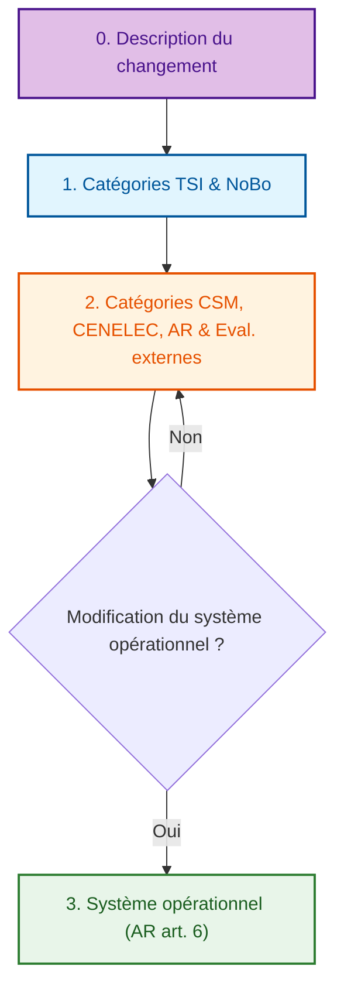
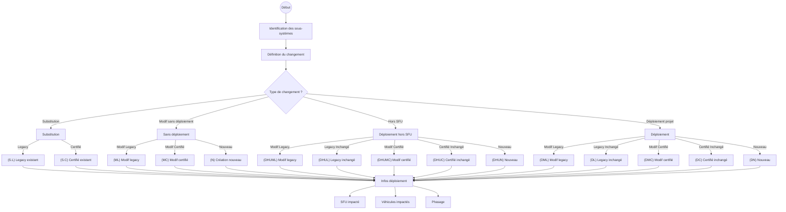
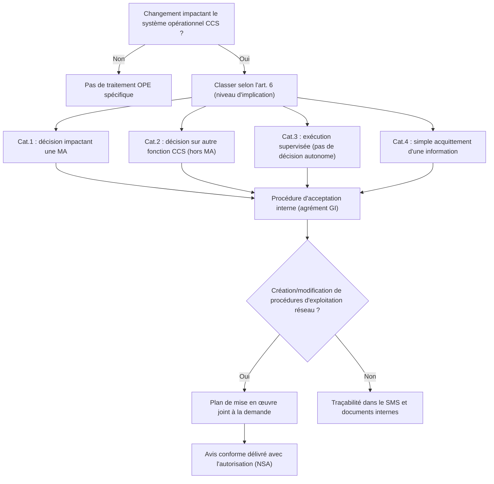

# Processus d'évaluation : Vue d'ensemble

Cliquez sur les boîtes ci-dessous pour accéder au détail de chaque étape.

> **Navigation rapide** : [0. Description](#0-desc) | [1. Détail TSI](#1-tsi) | [2. Détail CSM & EN 50126](#2-csm-cen) | [3. Système opérationnel](#3-ope)

---

---

## 0. Description du changement

### Identification du changement
1. **Identification des sous-systèmes impactés** :
   - [ ] Infrastructure
   - [ ] Energie
   - [ ] Contrôle-commande et signalisation au sol
   - [ ] Contrôle-commande et signalisation à bord
   - [ ] Exploitation et gestion du trafic (procédures et / ou équipements)
   - [ ] Applications télématiques
   - [ ] Matériel roulant
   - [ ] Entretien (procédures et/ou équipements)

2. **Nature du changement (par sous-système)** :
   Sélectionner le type de changement parmi les options suivantes :

### Définitions détaillées des changements
- **(S.L)** Substitution d'un produit legacy existant
- **(S.C)** Substitution d'un produit certifié existant
- **(ML)** Modification d'un système de référence legacy sans déploiement prévu dans ce projet
- **(MC)** Modification d'un système de référence certifié sans déploiement prévu dans ce projet
- **(N)** Création d'un nouveau système sans déploiement prévu dans ce projet
- **(DHUML)** Déploiement hors du système ferroviaire de l'Union de la modification d'un système de référence legacy
- **(DHUL)** Déploiement hors du système ferroviaire de l'Union d'un système de référence legacy et inchangé
- **(DHUMC)** Déploiement hors du système ferroviaire de l'Union de la modification d'un système de référence certifié
- **(DHUC)** Déploiement hors du système ferroviaire de l'Union d'un système de référence certifié et inchangé
- **(DHUN)** Création et déploiement hors du système ferroviaire de l’Union d'un nouveau système
- **(DML)** Déploiement de la modification d'un système de référence legacy
- **(DL)** Déploiement d'un système legacy de référence inchangé
- **(DMC)** Déploiement de la modification d'un système de référence certifié
- **(DC)** Déploiement d'un système de référence certifié et inchangé
- **(DN)** Création et déploiement d'un nouveau système

### Informations de déploiement
- **SFU impacté** : Lignes ou régions
- **Véhicules de l'Union impactés** : Oui / Non
- **Phasage** :
    - Phase(s) projet pilote
    - Phase(s) projet rollout
    - Pas de phase (un seul déploiement)

---

## 1. Catégorie TSI et NoBo (checklist verticale)

> **Note** : on ne garde ici que les TSI **susceptibles de mener à un NoBo** (INF, CCS, ENE, RST). Les aspects purement **opérationnels/SMS** (OPE, TAP/TAF, Entretien) **ne sont pas dans ce bloc**. [1](https://www.era.europa.eu/domains/technical-specifications-interoperability/operation-and-traffic-management-tsi_en)[2](https://eur-lex.europa.eu/eli/reg_impl/2019/773/oj/eng)

```mermaid
flowchart TB
    START["DÉBUT : Identification TSI"] --> CHECK_INF{"Infrastructure (INF) ?"}
    
    %% 1. INFRASTRUCTURE
    CHECK_INF -->|Oui| Q_TSI_INF{"TSI INF, PRM, SRT applicable ?"}
    Q_TSI_INF -->|Non| T_INF_M1["[TSI-1] Pas de NoBo"]:::tsi_m1
    Q_TSI_INF -->|Oui| Q_P_INF{"Paramètre TSI modifié ?"}
    Q_P_INF -->|Non| T_INF_0["[TSI0] Pas de NoBo"]:::tsi_0
    Q_P_INF -->|Oui| ADD_INF["[TSI1] NoBo (TSI INF/PRM/SRT)"]:::tsi_1
    ADD_INF --> CHECK_CCS
    T_INF_M1 --> CHECK_CCS
    T_INF_0 --> CHECK_CCS
    CHECK_INF -->|Non| CHECK_CCS

    %% 2. CCS (SANS DÉCOUPE SOL/BORD)
    CHECK_CCS{"Contrôle-commande & signalisation (CCS) ?"}
    CHECK_CCS -->|Oui| Q_TSI_CCS{"TSI CCS applicable ?"}
    Q_TSI_CCS -->|Non| T_CCS_M1["[TSI-1] Pas de NoBo"]:::tsi_m1

    %% ERA ERTMS trackside approval (interop, avant appel d'offres, via OSS)
    Q_TSI_CCS -->|Oui| ERA19["ERTMS trackside approval (ERA, art. 19) - via One-Stop Shop (OSS) - avant appel d'offres"]

    %% Puis logique TSI0/TSI1
    ERA19 --> Q_P_CCS{"Paramètre TSI modifié ?"}
    Q_P_CCS -->|Non| T_CCS_0["[TSI0] Pas de NoBo"]:::tsi_0
    Q_P_CCS -->|Oui| ADD_CCS["[TSI1] NoBo (TSI CCS)"]:::tsi_1
    ADD_CCS --> CHECK_ENE
    T_CCS_M1 --> CHECK_ENE
    T_CCS_0 --> CHECK_ENE
    CHECK_CCS -->|Non| CHECK_ENE

    %% 3. ÉNERGIE
    CHECK_ENE{"Énergie (ENE) ?"}
    CHECK_ENE -->|Oui| Q_TSI_ENE{"TSI ENE/SRT applicable ?"}
    Q_TSI_ENE -->|Non| T_ENE_M1["[TSI-1] Pas de NoBo"]:::tsi_m1
    Q_TSI_ENE -->|Oui| Q_P_ENE{"Paramètre TSI modifié ?"}
    Q_P_ENE -->|Non| T_ENE_0["[TSI0] Pas de NoBo"]:::tsi_0
    Q_P_ENE -->|Oui| ADD_ENE["[TSI1] NoBo (TSI ENE/SRT)"]:::tsi_1
    ADD_ENE --> CHECK_RST
    T_ENE_M1 --> CHECK_RST
    T_ENE_0 --> CHECK_RST
    CHECK_ENE -->|Non| CHECK_RST

    %% 4. MATÉRIEL ROULANT
    CHECK_RST{"Matériel roulant (RST) ?"}
    CHECK_RST -->|Oui| Q_TSI_RST{"TSI LOC&PAS/WAG/PRM/NOI/SRT applicable ?"}
    Q_TSI_RST -->|Non| T_RST_M1["[TSI-1] Pas de NoBo"]:::tsi_m1
    Q_TSI_RST -->|Oui| Q_P_RST{"Paramètre TSI modifié ?"}
    Q_P_RST -->|Non| T_RST_0["[TSI0] Pas de NoBo"]:::tsi_0
    Q_P_RST -->|Oui| ADD_RST["[TSI1] NoBo (TSI LOC&PAS/WAG/PRM/NOI/SRT)"]:::tsi_1

    %% Fin
    ADD_RST --> END["Fin Analyse TSI"]
    T_RST_M1 --> END
    T_RST_0 --> END
    CHECK_RST -->|Non| END

    %% Styles
    classDef tsi_1 fill:#e1f5fe,stroke:#01579b,stroke-width:2px;
    classDef tsi_0 fill:#fff3cd,stroke:#e65100,stroke-width:1px;
    classDef tsi_m1 fill:#e8f5e9,stroke:#2e7d32,stroke-width:1px;
```

## Définition des catégories et impacts

### Catégories TSI (Interopérabilité)

| ID | Définition | Impact évaluation |
| :--- | :--- | :--- |
| **TSI-1** | Changement hors périmètre des TSI | Pas de NoBo |
| **TSI0** | Changement n’affectant aucun paramètre réglementé par les TSI | Pas de NoBo |
| **TSI1** | Changement affectant au moins un paramètre réglementé par les TSI | NoBo |

---

## 2. Catégories CSM, CENELEC, AR & Eval. externes

[Retour en haut](#processus-dévaluation-externe--vue-densemble)

```mermaid
flowchart TB

    %% =========================
    %% 1. FILTRES INITIAUX
    %% =========================
    START(["DÉBUT Analyse Sécurité"]) --> Q_SUBST{"Substitution ? (Maintenance)"}
    Q_SUBST -->|Oui| END_SUBST["CSM1 / CEN1 (Ni AsBo, ni ISA)"]:::ok

    Q_SUBST -->|Non| Q_SAFE{"Relatif à la sécurité ?"}
    Q_SAFE -->|Non| END_SAFE["CSM0 / CEN0 (Ni AsBo, ni ISA)"]:::ok

    %% =========================
    %% 2. DÉTERMINATION DE LA CATÉGORIE CSM
    %% =========================
    Q_SAFE -->|Oui| Q_CTX{"Déploiement dans le SFU ?"}

    %% BRANCHE A : HORS SFU ou SANS DÉPLOIEMENT
    Q_CTX -->|Non| RES_CAT_M1("CSM-1 (Pas d'AsBo)"):::note
    
    %% BRANCHE B : DANS LE SFU
    Q_CTX -->|Oui| Q_UNCHANGED{"Système inchangé ?"}

    Q_UNCHANGED -->|Oui| RES_CSM2_UNCH("CSM2 (Pas d'AsBo)"):::note
    Q_UNCHANGED -->|Non| Q_SIGNIF{"Impact sécurité significatif ?"}

    Q_SIGNIF -->|Non| RES_CSM2_MOD("CSM2 (Pas d'AsBo)"):::note
    Q_SIGNIF -->|Oui| Q_AMES{"AMES requise ? (Autorisation NSA)"}

    Q_AMES -->|Non| RES_CSM3("CSM3 (AsBo)"):::warn
    Q_AMES -->|Oui| RES_CSM4("CSM4 (AsBo & NSA)"):::risk

    %% =========================
    %% 3. ETCS ASBO CHECK
    %% =========================
    RES_CAT_M1 --> CHECK_ETCS
    RES_CSM2_UNCH --> CHECK_ETCS
    RES_CSM2_MOD --> CHECK_ETCS
    RES_CSM3 --> CHECK_ETCS
    RES_CSM4 --> CHECK_ETCS
    
    CHECK_ETCS{"TSI CCS 2023 (ETCS) ?"}
    CHECK_ETCS -->|Oui| FORCE_ASBO["+ CSM RA (AsBo) - Obligatoire"]:::risk
    CHECK_ETCS -->|Non| NEXT_CEN((Suite))
    FORCE_ASBO --> NEXT_CEN

    %% =========================
    %% 4. CATÉGORISATION CENELEC
    %% =========================
    NEXT_CEN --> Q_NATURE{"Nature du Système ?"}

    %% CAS LEGACY
    Q_NATURE -->|Legacy| RES_CEN_M1["CEN-1 (Pas d'ISA)"]:::ok

    %% CAS CERTIFIÉ / NOUVEAU
    Q_NATURE -->|"Certifié ou Nouveau"| Q_CYCLE{"Impact sur Cycle de Vie ?"}

    Q_CYCLE -->|Mineur| RES_CEN2["CEN2 (Pas d'ISA)"]:::note
    Q_CYCLE -->|Majeur| RES_CEN3["CEN3 (ISA REQUIS)"]:::risk

    %% =========================
    %% 5. IDENTIFICATION REFERENTIEL TECHNIQUE (HW/SW)
    %% =========================
    RES_CEN_M1 --> Q_SIG_HW
    RES_CEN2 --> Q_SIG_HW
    RES_CEN3 --> Q_SIG_HW

    Q_SIG_HW{"Matériel Signalisation ?"}
    Q_SIG_HW -->|Oui| ADD_50129["+ EN 50129"]:::cen    
    Q_SIG_HW -->|Non| NEXT_SW((Suite))
    ADD_50129 --> NEXT_SW

    NEXT_SW --> Q_SW{"Logiciel (SW) ?"}
    Q_SW -->|Oui| ADD_50128["+ EN 50128"]:::cen
    Q_SW -->|Non| END([Fin Référentiel Sécurité])
    ADD_50128 --> END

    %% =========================
    %% LEGENDES & STYLES
    %% =========================
    classDef ok fill:#cfc,stroke:#090,stroke-width:2px;
    classDef note fill:#eef,stroke:#00d,stroke-width:2px;
    classDef warn fill:#ffeba1,stroke:#d90,stroke-width:2px;
    classDef risk fill:#fbb,stroke:#d00,stroke-width:4px;
    classDef cen fill:#f3e5f5,stroke:#4a148c,stroke-width:2px;
```

---

## Définition des catégories et impacts

### Catégories CSM (Sécurité)

| ID | Définition | Impact évaluation |
| :--- | :--- | :--- |
| **CSM-1** | Changement hors périmètre de la CSM | Pas d’AsBo |
| **CSM0** | Changement non relatif à la sécurité | Pas d’AsBo |
| **CSM1** | Substitution dans le cadre d'un entretien | Pas d’AsBo |
| **CSM2** | Changement relatif à la sécurité avec impact non-significatif | Pas d’AsBo (sauf si TSI CCS 2023 est applicable) |
| **CSM3** | Changement relatif à la sécurité avec impact significatif sans autorisation de mise en service par la NSA | AsBo |
| **CSM4** | Changement relatif à la sécurité avec impact significatif et avec autorisation de mise en service par la NSA | AsBo & NSA AMES |

### Catégories EN 50126 (CENELEC)

| ID | Définition | Impact évaluation |
| :--- | :--- | :--- |
| **CEN-1** | Changement hors périmètre de EN 50126 | Pas d’ISA |
| **CEN0** | Changement non relatif à la sécurité | Pas d’ISA |
| **CEN1** | Substitution dans le cadre d'un entretien | Pas d’ISA |
| **CEN2** | Changement nécessistant aucunes ou des preuves de sécurité mineures | Pas d’ISA |
| **CEN3** | Changement nécessistant des preuves de sécurité significatives | ISA |

---

## 3. Système opérationnel (AR art. 6)

